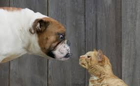

# Cat-Vs-Dogs

## Libraries and API's

- Keras
- Matplotlib

## Dataset Source
- [Kaggle](https://www.kaggle.com/biaiscience/dogs-vs-cats)
## Info
- A famous Classification problem of differentiating Cats and Dogs from Kaggle.
- Dataset contains 25000 images with no class imbalence
- Applied Transfer learning technique with ResNet50 and weights that of ImageNet
- Train,Test Split : 90%,10%
- Acheived accuracy of ~95% on Training data and ~98% on Test Data
- You can run the notebook in Colab and Can try your images by running Last Cell and Uploading the images
